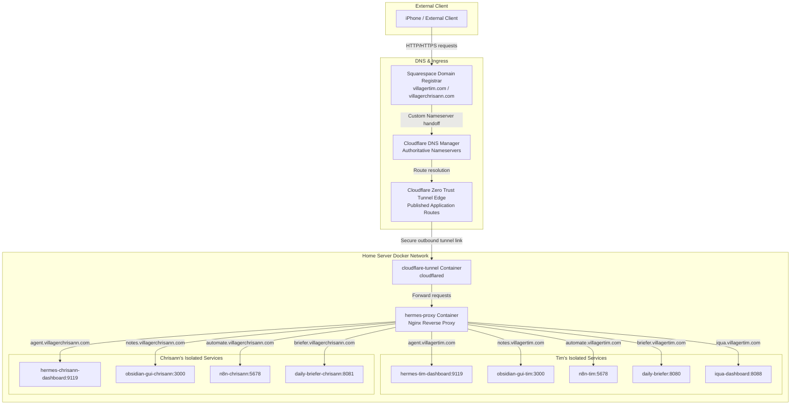

# Squarespace and Cloudflare Integration Guide

This document describes the steps taken to integrate Squarespace custom domains with a home-hosted multi-tenant Docker stack via Cloudflare Zero Trust Tunnels. It serves as a guide for future reference or rebuilds.

---

## 1. Architecture Overview

---

## 2. Registrar Setup (Squarespace)

To shift DNS authority to Cloudflare while retaining domain registration on Squarespace:

1. **Custom Nameservers Configuration**:
   * Navigate to the Squarespace Domain Dashboard.
   * Select the domain (e.g., `villagertim.com` or `villagerchrisann.com`).
   * Go to **DNS** -> **Domain Nameservers**.
   * Click **Use Custom Nameservers**.
   * Enter the assigned Cloudflare nameservers:
     * `april.ns.cloudflare.com`
     * `fonzie.ns.cloudflare.com`

2. **DNSSEC Disablement**:
   * Squarespace will generate a warning indicating that custom nameservers will disable DNSSEC and disrupt routing.
   * Click **Continue** to approve the handoff. Squarespace will remove the DNSSEC lock, allowing Cloudflare to manage resolution.

---

## 3. Standard DNS Cleanup (Cloudflare DNS Panel)

After adding the domain to Cloudflare, the DNS records table imports default Squarespace records. The following cleanups are required:

* **Remove Squarespace Web Records**:
  * Delete all 4 default **A** records pointing to Squarespace web servers (IPs starting with `198.185.159.x` and `198.49.23.x`).
  * Delete the **CNAME** record for `www` pointing to `ext-sq.squarespace.com`.
* **Retain Verification & Connection Records**:
  * Keep the CNAME record for `_domainconnect` pointing to `_domainconnect.domains.squarespace.com`. This maintains the secure infrastructure link between Cloudflare and Squarespace.
  * Do not modify or delete **MX** records or email validation **TXT** records (such as SPF, DMARC, or DKIM) to ensure Gmail/Google Workspace accounts remain operational.

---

## 4. Cloudflare Zero Trust Tunnel Setup

The tunnel manages secure external ingress without port-forwarding on the residential router.

1. **Initialize Zero Trust**:
   * Go to the Cloudflare Dashboard and select **Zero Trust**.
   * Create a Team Name (e.g., `villagertc-home-stack`) and select the Free Tier.
2. **Create the Tunnel**:
   * Navigate to **Networks** -> **Tunnels**.
   * Click **Create a tunnel**, select **Cloudflared**, and click **Next**.
   * Name the tunnel (e.g., `hermes-home-server`) and save.
3. **Deploy the Connector**:
   * Select **Docker** as the environment.
   * Copy the command token (the long string starting with `eyJh...`).
   * Save this token as `CLOUDFLARE_TUNNEL_TOKEN` inside the server's `.env` environment file.

---

## 5. Ingress Route Configuration (Public Hostnames)

To expose subdomains safely over the internet:

1. **Route Location**:
   * Open the tunnel configuration inside the Zero Trust dashboard.
   * Navigate to the **Public Hostnames** tab (do not use the WARP-only "Hostname routes" tab).
2. **Path Configuration**:
   * Leave the **Path** text field completely empty to allow absolute wildcard matching for all incoming URL requests.
3. **Public Hostnames Configuration Table**:

| Subdomain | Domain | Service Type | URL / Target |
| :--- | :--- | :--- | :--- |
| `agent` | `villagertim.com` | `HTTP` | `hermes-proxy` |
| `notes` | `villagertim.com` | `HTTP` | `hermes-proxy` |
| `automate` | `villagertim.com` | `HTTP` | `hermes-proxy` |
| `briefer` | `villagertim.com` | `HTTP` | `hermes-proxy` |
| `iqua` | `villagertim.com` | `HTTP` | `hermes-proxy` |
| `agent` | `villagerchrisann.com` | `HTTP` | `hermes-proxy` |
| `notes` | `villagerchrisann.com` | `HTTP` | `hermes-proxy` |
| `automate` | `villagerchrisann.com` | `HTTP` | `hermes-proxy` |
| `briefer` | `villagerchrisann.com` | `HTTP` | `hermes-proxy` |

4. **Catch-All Rule**:
   * Set the default root path or unmatched requests to return an `HTTP 404` status on the Cloudflare edge to drop unauthorized traffic.

---

## 6. Critical Gotchas & Troubleshooting

### DNS Record Collision Error
* **Problem**: Attempting to add a public hostname inside the Zero Trust Tunnel manager returns an error: *"An A, AAAA, or CNAME record with that host already exists."*
* **Cause**: Manual CNAME records for subdomains (e.g., `agent`, `notes`, `automate`) were created in the standard Cloudflare DNS Records table. This blocks the tunnel manager from auto-generating its dynamic routing records.
* **Resolution**: Delete all manual subdomain CNAME records from the standard DNS Records table first. Then configure them under the Zero Trust Tunnel Public Hostnames tab. The tunnel manager automatically handles DNS generation in the background.

### URL Validation Error
* **Problem**: Entering `hermes-proxy:80` inside the Zero Trust Service URL field throws a red validation error.
* **Cause**: The Zero Trust form validator flags the port colon (`:`) when the Service Type dropdown is set to `HTTP` (which implies port 80).
* **Resolution**: Input only the container hostname `hermes-proxy` in the URL field.

### Dashboard Tab Layout Gotcha
* **Problem**: Routing rules are configured, but pages return 404 errors or refuse connections.
* **Cause**: Configuration rules were added under the `Hostname routes (Beta)` tab. This section is reserved for private internal WARP client mesh tunnels.
* **Resolution**: Delete those rules and configure the subdomains under the **Published application routes** (or Public Hostnames) tab.

---

## 7. Local Server Orchestration (Nginx Reverse Proxy)

Inside the server, a single `nginx` container (`hermes-proxy`) acts as a virtual host router. It handles:

* **Host Header Parsing**: Incoming traffic reaches port 80 of the proxy via the tunnel. Nginx inspects the Host header and maps it to the target service container.
* **WebSocket Ingress**: Headers are injected to support WebSockets, which are required for dashboards, VNC-based Obsidian GUIs, and interactive elements.
* **Basic Authentication**: Visual interfaces are protected using separate credentials stored in `.htpasswd-tim` and `.htpasswd-chrisann`.

This configuration isolates all internal tenant components, ensuring Tim's and Chrisann's environments do not cross over.
